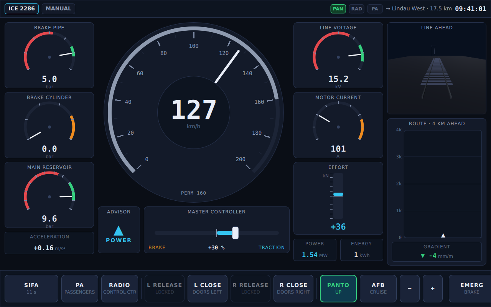
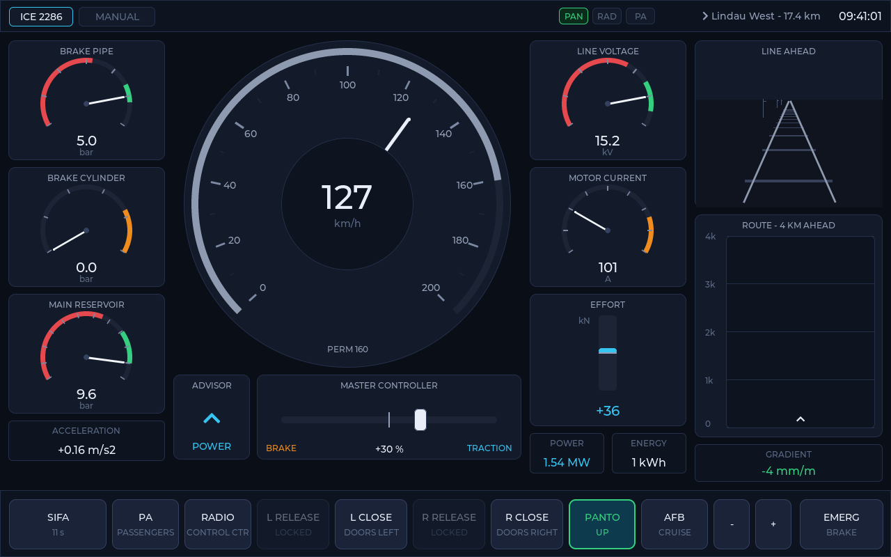
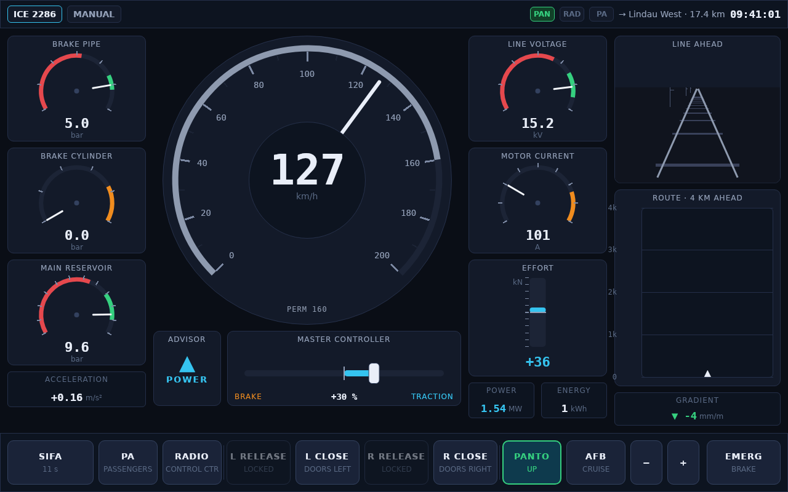
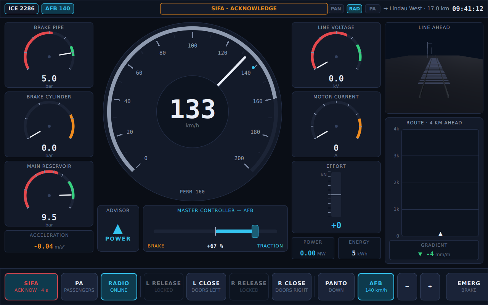
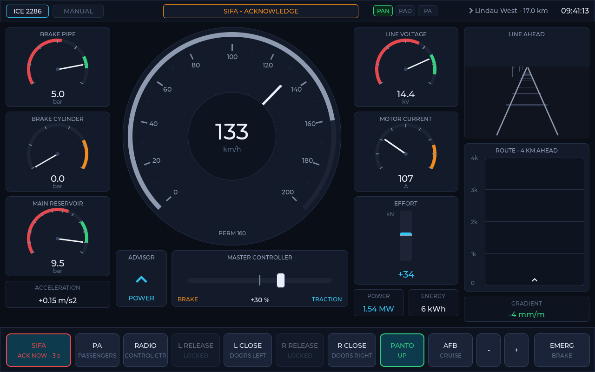
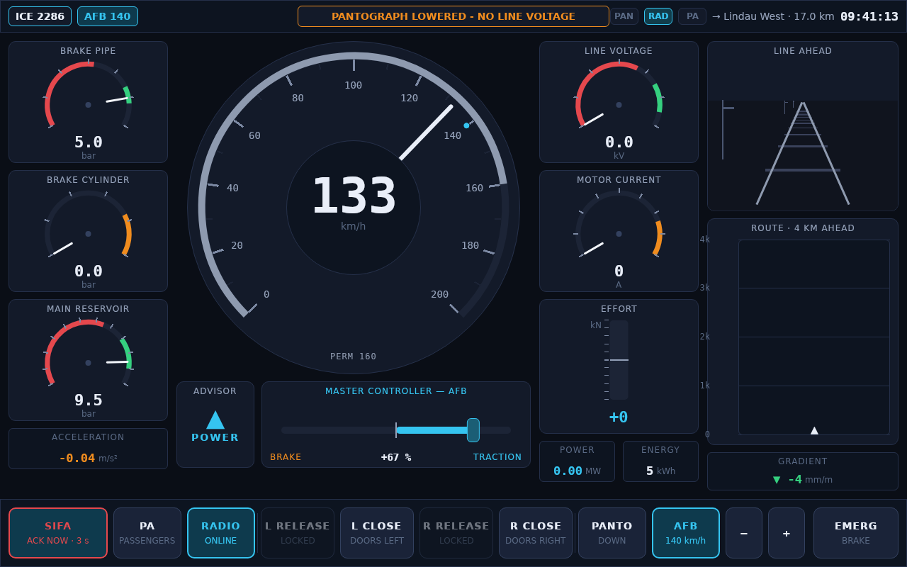

# RailDeck Pro — Train Driver's Cab Display

[](../../actions/workflows/ci.yml)
[](../../actions/workflows/codeql.yml)
[](LICENSE)

A modern driver's cab display (train HMI) with **three interchangeable UI frontends —
Qt Quick (QML), LVGL and Slint — sharing one simulation core and one design-token
set**, so all of them render the same instruments with the same look & feel.

| Qt Quick frontend | LVGL frontend | Slint frontend |
|---|---|---|
|  |  |  |
|  |  |  |

## Features

**Instruments**
- Circular speedometer (0–200 km/h) with supervision ring in the style of modern
  cab signalling displays: grey *permitted* arc, yellow *braking-curve indication*
  towards the next target, orange *overspeed* band, red *intervention* band;
  digital speed, target speed + distance-to-target readout, cruise set-speed marker
- Pneumatics: brake pipe, brake cylinder, main reservoir gauges with colored zones
- Electric: line voltage, motor current, bipolar tractive-effort bar
  (traction ↑ cyan / regenerative brake ↓ green), power and energy readouts
- Route planning strip: the next 4 km with speed-limit changes, station stops,
  the supervised braking target and current gradient
- Line-ahead view: rails, sleepers and catenary masts moving with train speed,
  pitch/horizon follows the gradient, braking target as a yellow lineside board —
  real 3D (Qt Quick 3D) in the Qt frontend, perspective projection drawn with
  primitives in the LVGL and Slint frontends
- Acceleration, next station + distance, service clock, odometer

**Controls & safety systems**
- **SIFA** (dead man's / vigilance device) with full escalation:
  armed → visual warning → audible warning → penalty brake; release only after a
  full stop + acknowledgement
- **PA** — announcement to passengers; **RADIO** — voice call to the control centre
- **Door controls** per side: release (standstill-only) / close, with door state
  machine and **traction interlock** while doors are not locked
- **Pantograph** up/down (traction and line voltage follow)
- **AFB cruise control** with set-speed +/- and speedometer marker
- **Emergency brake**, releasable only at standstill
- Master controller (combined power/brake lever), draggable, driven by AFB when active
- Driving advisor (DAS): POWER / HOLD / COAST / BRAKE hint for efficient driving
- Speed supervision: overspeed warning and automatic brake intervention on the
  braking curve towards lower limits and station stops
- Alert ticker with severity colors and blinking for critical alerts

**Simulation** (UI-independent, deterministic)
- Longitudinal dynamics: traction force/power curve, blended electrodynamic +
  pneumatic braking, running resistance, gradients
- Pneumatic model: brake pipe, cylinder, main reservoir with compressor hysteresis
- 40 km looped demo route with three stations, speed limits from 60 to 200 km/h

## Architecture

```
design/theme.json          single source of truth for colors/fonts/metrics
   └── design/generate_tokens.py
         ├── ui-qt/qml/Theme.qml       (generated QML singleton)
         ├── shared/theme_tokens.h     (generated C header)
         └── ui-slint/ui/Theme.slint   (generated Slint global)

core/                      traincore — pure C++17, no UI dependency
   ├── train_types.h       TrainState snapshot, Command enum, route types
   └── train_simulation.h  tick(dt) / setLever() / command() / state()

ui-qt/                     Qt Quick frontend (QML, Qt 6.5+, tested 6.10/6.11)
ui-lvgl/                   LVGL v9.3 frontend (SDL2 desktop simulator)
ui-slint/                  Slint 1.17 frontend (prebuilt C++ package, no Rust needed)
tests/                     core smoke tests (ctest)
```

### UI interchangeability

The frontends are deliberately thin: a UI owns **one** `traincore::TrainSimulation`,
calls `tick(dt)` from its own timer, forwards operator input through exactly two
entry points — `setLever(percent)` and `command(Command)` — and renders the
`TrainState` snapshot. Nothing else crosses the boundary.

To port the HMI to another UI technology (e.g. Flutter, web):
1. render `TrainState` (all displayed values live there),
2. map your widgets' events to `Command` values and the lever to `setLever()`,
3. generate your color/font constants from `design/theme.json`
   (extend `generate_tokens.py` with a new emitter).

The Slint frontend (`ui-slint/`) is exactly such a port: ~150 lines of C++
(`src/main.cpp`) bridge the core to declarative `.slint` markup, and
`generate_tokens.py` gained a third emitter for `Theme.slint`.

## Building

Requirements: CMake ≥ 3.21, C++17 compiler; Qt 6.5+ for the Qt frontend;
SDL2 for the LVGL frontend (LVGL v9.3 is fetched automatically; the Slint
frontend needs nothing extra — the official prebuilt Slint C++ package is
fetched automatically too, no Rust toolchain required).

```bash
# all three frontends
cmake -S . -B build -G Ninja -DCMAKE_BUILD_TYPE=Release \
      -DCMAKE_PREFIX_PATH=~/Qt/6.10.2/gcc_64 \
      -DRAILDECK_UI=all           # or: qt | lvgl | slint | both (= qt+lvgl)
cmake --build build

./build/ui-qt/raildeck-qt          # Qt Quick frontend
./build/ui-lvgl/raildeck-lvgl      # LVGL frontend
./build/ui-slint/raildeck-slint    # Slint frontend
ctest --test-dir build             # core smoke tests
```

On Windows with the Qt online installer, e.g. Qt 6.11.1 / MSVC 2022:

```bat
cmake -S . -B build -DCMAKE_PREFIX_PATH=C:/Qt/6.11.1/msvc2022_64 -DRAILDECK_UI=qt
cmake --build build --config Release
```

Note for WSL2: the Windows-side Qt kits (`/mnt/c/Qt/...`, MSVC/MinGW) cannot be
used from inside WSL — use a Linux Qt kit there (e.g. `~/Qt/6.10.2/gcc_64`).

### Verification screenshots

All three binaries support headless verification:

```bash
raildeck-qt    --screenshot out.png [--screenshot-delay ms]
raildeck-lvgl  --screenshot out.bmp [--screenshot-delay ms]
raildeck-slint --screenshot out.bmp [--screenshot-delay ms]   # SLINT_BACKEND=winit-software under xvfb
```

## Keyboard controls (Qt and Slint frontends)

| Key | Action | Key | Action |
|---|---|---|---|
| `Space` | SIFA acknowledge | `Q` | PA to passengers |
| `↑`/`W` | lever +10 % | `C` | radio to control centre |
| `↓`/`S` | lever −10 % | `T` | pantograph up/down |
| `X` | lever to 0 | `A` | AFB cruise on/off |
| `1`/`2` | doors left release/close | `+`/`−` | AFB set speed ±10 |
| `3`/`4` | doors right release/close | `E` | emergency brake |

The LVGL frontend is touch/mouse-driven (all functions on the button bar).

## Design tokens

Edit `design/theme.json`, then regenerate all frontends' constants:

```bash
python3 design/generate_tokens.py
```

## Quality toolchain (verification)

Requirements-as-code with full ASPICE-style traceability, four static
analyzers, three sanitizers and structural coverage — one command drives it:

```bash
./setup.sh                     # provision all tools (naked Debian/Ubuntu)
./build_all.sh --skip axivion  # build, test, trace, docs, coverage, analysis, sanitize
./clean_all.sh                 # remove everything generated
```

| Leg | Tooling | Artefact |
|-----|---------|----------|
| Requirements | StrictDoc (`requirements/requirements.sdoc`, single source of truth) | `docs/strictdoc/`, generated `docs/requirements.md` |
| Traceability | `tools/trace_report.py` — REQ ↔ DES ↔ TS ↔ result, fails on hard gaps | `docs/traceability.html` |
| Tests | dependency-free harness with JUnit per test function (`tools/run_tests.sh`) | `test-results/*.xml` |
| Static analysis | cppcheck, clang-tidy, clazy, g++ -fanalyzer, codespell (`tools/static_analysis.sh`) | `analysis-results/` |
| Sanitizers | ASan+UBSan, TSan, valgrind memcheck (`tools/sanitize.sh`) | `analysis-results/sanitize-*` |
| Coverage | gcov line/branch + clang-18 MC/DC; Squish Coco when licensed (`tools/coverage.sh`) | `coverage/` |
| Docs | Doxygen + graphviz (`tools/make_docs.sh`) | `docs/html/` |
| Supply chain | syft SBOM, grype, trivy (`tools/supply_chain.sh`, also in CI) | `analysis-results/supply-chain/` |
| Axivion (optional) | MISRA C++ 2023 + CWE + Qt rules, architecture views; imports all logs above onto one dashboard (`axivion/`) | local dashboard |

CI (GitHub Actions) runs build+tests+traceability+screenshot smoke on Linux,
Qt-frontend builds on Windows/macOS, the ASan leg, a non-gating
static-analysis report, CodeQL and the supply-chain scans on every PR.
Contributing? See [CONTRIBUTING.md](CONTRIBUTING.md).

## License

[MIT](LICENSE)
